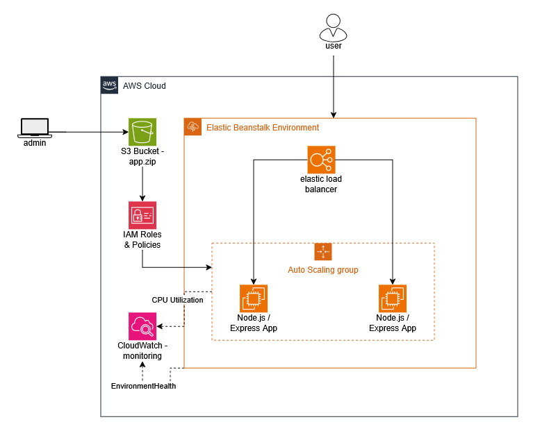

# Node.js on AWS Elastic Beanstalk with Terraform

A Node.js app deployed to AWS Elastic Beanstalk, with the entire infrastructure (S3, IAM, Elastic Beanstalk, CloudWatch) defined and managed using Terraform instead of manual AWS Console setup.
## Architecture

## What this project does

- Deploys a small Express.js app to AWS
- Uses Terraform to create the S3 bucket, IAM roles, Elastic Beanstalk application/environment, and CloudWatch alarms
- Sets up basic monitoring (CPU usage and environment health)
- Everything can be brought up or torn down with a single command

## Tech stack

- Node.js + Express
- Terraform
- AWS: Elastic Beanstalk, S3, IAM, CloudWatch

## Project structure

```
nodejs-eb-terraform/
├── app/
│   ├── index.js
│   ├── package.json
│   └── .gitignore
│
├── terraform/
│   ├── version.tf
│   ├── variables.tf
│   ├── s3.tf
│   ├── iam.tf
│   ├── main.tf
│   ├── cloudwatch.tf
│   ├── outputs.tf
│   └── terraform.tfvars.example
│
├── screenshots/
├── .gitignore
└── README.md
```

## App routes

- `/` – homepage
- `/health` – health check endpoint (used by Elastic Beanstalk to confirm the app is running)
- `/api/info` – returns basic app info as JSON

## Prerequisites

- Node.js installed
- AWS account + AWS CLI configured (`aws configure`)
- Terraform installed

## How to run it

Test locally first:
```bash
cd app
npm install
npm start
```
Visit `http://localhost:8080`.

Deploy to AWS:
```bash
cd terraform
cp terraform.tfvars.example terraform.tfvars
terraform init
terraform plan
terraform apply
```

After it finishes, Terraform prints the live app URL.

Update and redeploy:
```bash
# edit app/index.js
# bump app_version_label in terraform.tfvars
terraform apply
```

Tear everything down when done (to avoid AWS charges):
```bash
terraform destroy
```

## Monitoring

Two CloudWatch alarms are created:
- High CPU usage (above 80% for 10+ minutes)
- Degraded Elastic Beanstalk environment health

## Notes

This was built as a learning project to practice Infrastructure as Code and get hands-on with AWS deployment basics. Everything fits within the AWS free tier as long as resources are destroyed after use.

